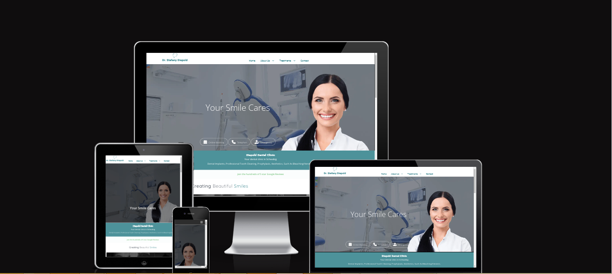
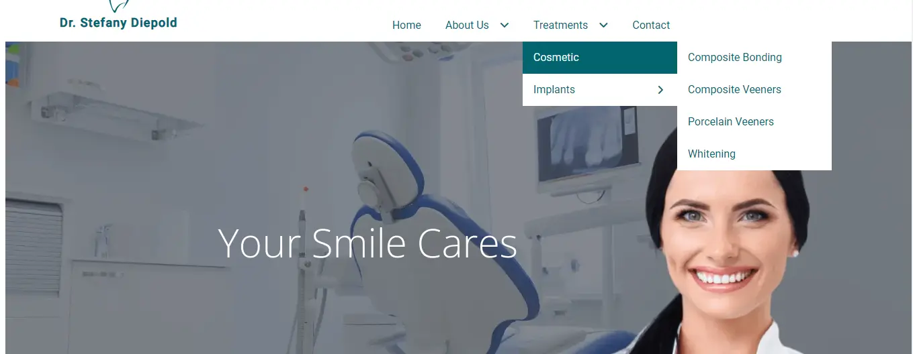
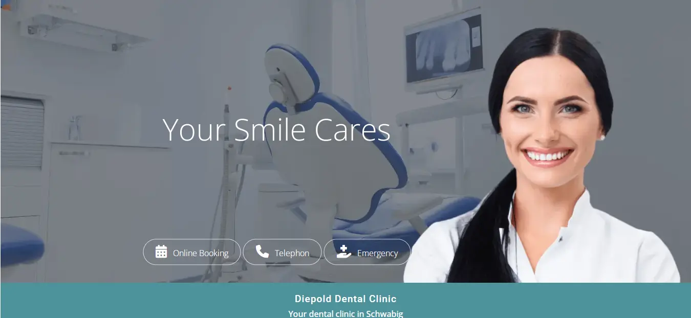
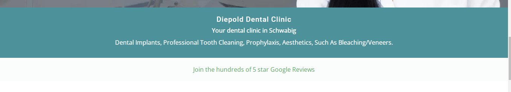
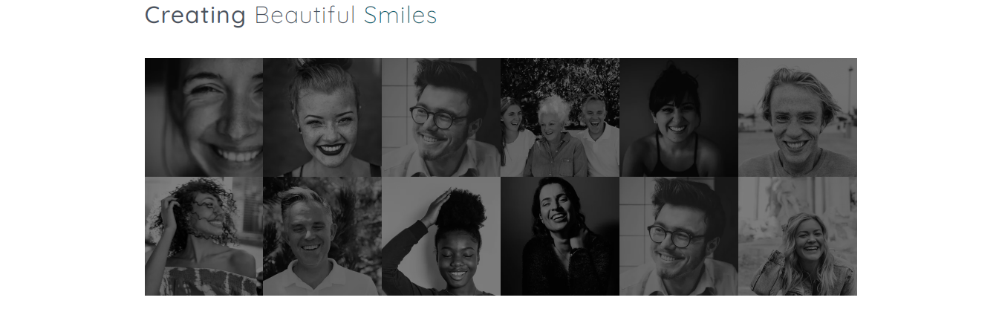
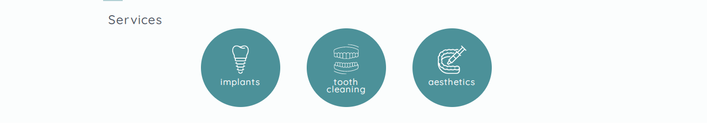
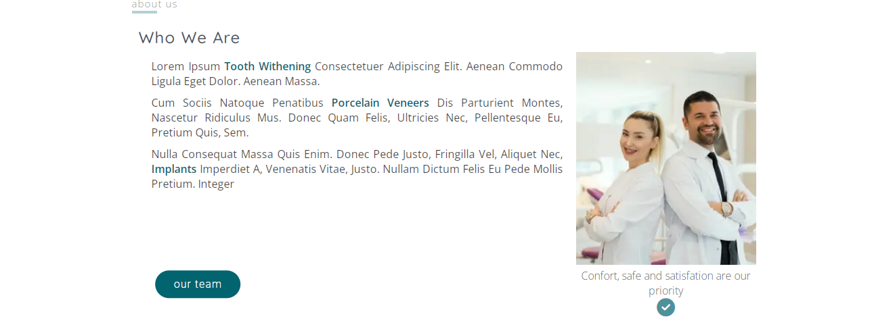
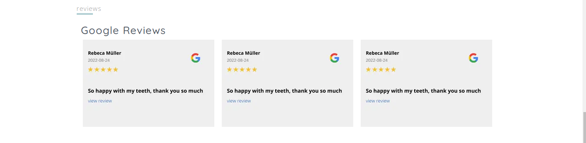
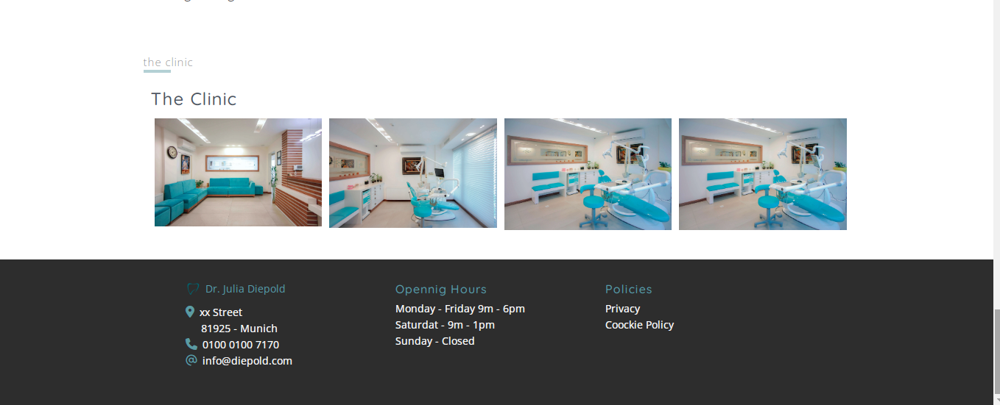
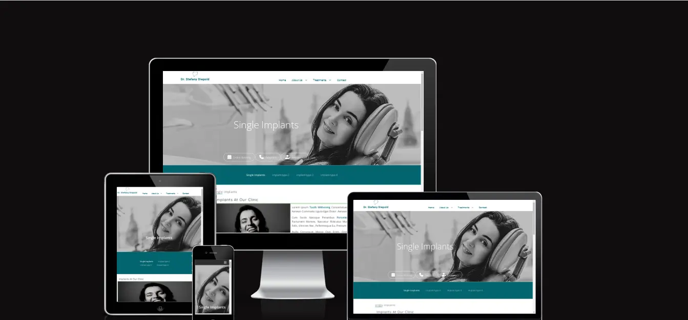

# Dental Clinic Project

Dental Clinic is a site developed to dental clinic specialized in providing beautiful smiles through  dental implants and aesthetics dentistry. The visual communication was design to connect with its target group: women.

Welcome to [Dental Clinic](https://cintiamar.github.io/dental-clinic/)

### Design Concept
The  design concept of the website communicates dental aesthetics, with a  friendly atmosphere with visual interactivity on images to provide a slight touch of modernity.

A welcoming atmosphere was designed with a gallery of smiles of customers, to provide an opportunity to increase engagement with the customers and marketing.

### Colors
The blue and white colors were chosen because they refer to the health area. In addition, shades of blue convey confidence, according to neuromarketing studies.

### Website Pages
The site is designed to have the following pages bellow.
(Online scheduling is foreseen in the project but will be developed later with forms with java script. )

#### Website pages list

* Online Booking
* Emergency page
* About Us > Team 
* Implant > Single Implant, Implant type-2, Implant type-3 and Implant type-4
* Cosmetic > Whitening , Composite Bonding, Composite Venneers, Porcelai Venners,Tooth Cleaning
* FAQ
* Contact page ( with contact formular)
* Privacy
* Coockie Policy

### Features is missing and will be developed:
* FAQ section with accordeon
* Social Media icons with link at the footer
   
   

For this Readme file, the pages that have been fully developed so far will be described:
    • full responsive navigation bar
    • Home page
    • Single Implant
    • Whitening

## Existing Features
* Navigation Bar - dropdown menu

Featured on all  pages, the full responsive dropdown navigation bar includes links to the Logo with the name of the dentist, Home page, Gallery and Sign Up page and is identical in each page to allow for easy navigation.
This section will allow the user to easily navigate from page to page across all devices without having to revert back to the previous page via the ‘back’ button.
# Dental Clinic
* The Landing page image 

The landing includes a photograph  related to the page  with 3 buttons overlay, identical in each website page, to allow the user to quickly access the  website pages:
* online booking
* telephon
* emergency

Also the photograph of the landing page aims to let clear where the website visitor is landing.

### Landing Page - Message box

Bellow the landing page image, includes 2 boxes messages.
* Box message-1: with an blue backrgound  shows the neighborhood where the clinic is located (Schwabig) and description of the clinic's services.

* Box-message-2: provides information from google reviews and how good the clinic is rated.

### Smiles Gallery
The Creating Beautiful Smiles Gallery section presents the website visitor with satisfied photos of dental clinic clients, with a black and interactive focus gallery image for color photographs, providing an eye-catching animation to capture their attention and interest.

### Services 
Three icons shows the core services of the dental clinic with links redirecting to its website page.

### About Us
This section will allow the user to get to know the dentists at the clinic, their appearance and a button that leads to a subpage where more information and photos of the entire team will be provided.
In addition, in the text, where dentists' specializations are mentioned, these keywords are highlighted in blue with a link directing to a sub-page with more content on the subject.

### Google Reviews
The Google reviews section is a way to provide information about the quality of the clinic's service.
Offers the opportunity to connect directly via a link to Google Reviews and check the clinic's customer reviews and rates.

### Clinic Gallery and Footer
The  clinic gallery will provide the user to get know  how is the ambience of the clinic and its atmosphere.

## The Implant Page
Below the landing page is a box with links to all  implants types.
As "Active", the type of implant is in bold, which refers to the page, providing a visual communication to the visitor from where he is.

### Implants at our Clinic
An image of a satisfied and happy customer to provide visual communication of customer satisfaction with clinic's dental implant services. Next to photography, content with words highlighted in bold and respective links to more detailed information on the subject of keywords.

### Content area 
This section allows the clinic to provide more content on the topic. To create visual interaction with the page visitor, there is a gallery with 3 images on the topic.

### Call to Action and Google Reviews 
The CTA (Call to action) section with High Contrast Background Color, aims to draw visitors´s attention, inviting them to book a consultation with one of the experts at the dental clinic.

Again, as well as in homepage, Google Reviews with more customer reviews, reinforcing how satisfied clinic customers are with the services.

## Validator  Testing
###  HTML
All codings were checked at [W3C HTML Validator](https://validator.w3.org/#validate_by_input).

Therefore still remained an error :
* “ End tag a violates nesting rules.”  
 from dropdown menu that needs to be understood in order to be fixed.

 .

### CSS  
css stylesheets were checked at [W3C CSS Validator](https://jigsaw.w3.org/css-validator/).
Still remain a list of warnings related to -webkit-transition.
Will be fixed and understood as I go further to the nexts modules.

### Performance of  Website

The performance of website pages were checked at Lighthouse Google Chrome tool. Still remain some improvements specially related to JavaScript as indicated below:

* reduce unsused JavaScript
* resources are blocking the first paint of your page. Consider delivering critical JS/CSS inline and deferring all non-critical JS/styles

Note: Will be fixed as I go to the JavaScript module.

## Unfixed Bugs

In the About Us section of the homepage, there is a focus style which should be focused at the same time in one click.
For this style, there are JavaScript resources.
Will be fixed during JavaScript module

## Deployment

## Credits
Drop down menu credit to @rafonzoo http://rafonzo.blogspot.co.id/ 

## Media

The photos used  all website are from [Unplash](https://unsplash.com/) open site and the graphic design platform [Canva](https://www.canva.com/).

The images which were converted to .webp were converted at [Cloud Convert](https://cloudconvert.com/).
